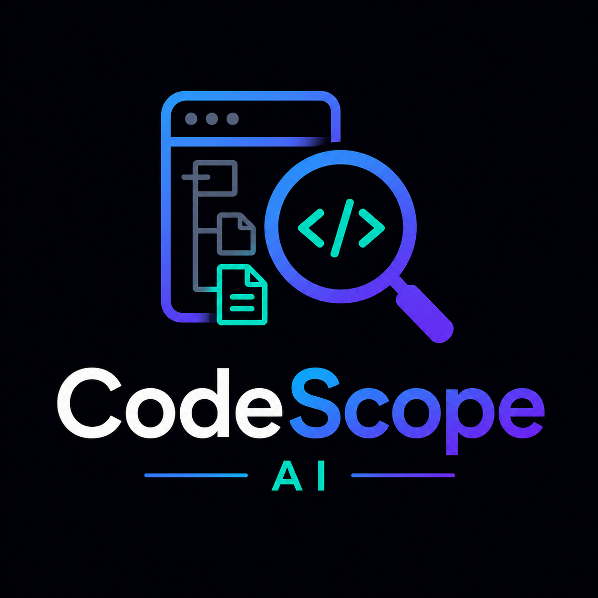

#  CodeScope AI


**CodeScope AI** is a production-ready, open-source tool that helps developers analyze GitHub issues and instantly discover where to start working in a codebase. By providing an issue URL, it fetches the repository's file tree and uses an advanced AI context window (Groq `llama-3.3-70b-versatile`) to point you straight to the files you need to modify.

## 🚀 Features
- **AI-Powered Code Navigation**: Get immediate context on complex issues.
- **Deep Issue Pagination**: Automatically loops page boundaries to fetch up to 500 open issues from massive repositories.
- **Production Grade Architecture**: React Server Components, clean glassmorphism Tailwind UI, and decoupled frontend architecture.
- **Secure Context Limit Handling**: Automatically scales to massive open-source project structures via intelligent tree-truncation strategies.

## 🛠 Tech Stack
- [Next.js 14](https://nextjs.org) (App Router)
- [React 18](https://react.dev)
- [Tailwind CSS](https://tailwindcss.com) & [Lucide Icons](https://lucide.dev)
- [Groq SDK](https://console.groq.com/docs/quickstart) (LLM Engine)

## 📦 Local Setup

1. **Clone the repository:**
   ```bash
   git clone https://github.com/PriDev07/CodeScope-AI
   ```

2. **Install dependencies:**
   ```bash
   npm install
   ```

3. **Configure Environment Variables:**
   Create a `.env.local` file at the root:
   ```env
   GROQ_API_KEY=your_groq_api_key_here
   ```
   *(Optional)* For higher GitHub API rate limits, add a personal access token:
   ```env
   GITHUB_TOKEN=your_github_token_here
   ```

4. **Run the development server:**
   ```bash
   npm run dev
   ```

## 🌍 Deployment

CodeScope AI is fully optimized for **Vercel** serverless environments.

1. Push your code to a GitHub repository.
2. Go to [Vercel](https://vercel.com/) and click **Add New Project**.
3. Import your `codescope-ai` repository.
4. Under **Environment Variables**, strictly add:
   - `GROQ_API_KEY` (Required)
   - `GITHUB_TOKEN` (Optional, Recommended for public users)
5. Click **Deploy**.

Next.js will automatically utilize Edge/Serverless functions for the API routes.

## 🤝 Contributing
Contributions, issues, and feature requests are welcome! 
Feel free to check [issues page](https://github.com/PriDev07/CodeScope-AI/issues).
## 📝 License
This project is open-sourced under the MIT License.
